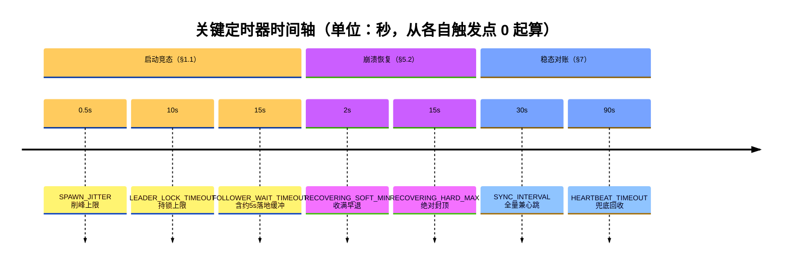
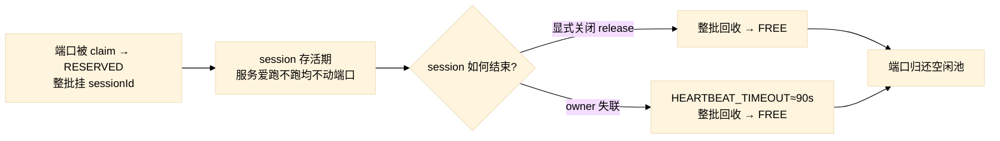

# AgentDock 新架构

> **AgentDock 定位**：为 agent 提供**完全隔离的开发环境**的运行时——对 agent **透明**地支撑**大规模 agent 并行**的 Isolated Runtime。每个 agent 在独立 worktree + 独立端口集的沙箱里开发，互不干扰；AgentDock 自身（Electron）在开发态也遵循同一套端口模型（§3、§8），因而能用 AgentDock 开发 AgentDock（递归自举，§9）。
>
> 本文档定义 AgentDock 与全局 Daemon 之间的职责边界、端口仲裁模型、崩溃恢复与并发所有权语义。
> 设计原则：**Daemon 是唯一真相源（Single Source of Truth），`.env` 永远不可信，端口必须 claim 而非 allocate。**
>
> **架构定位：单机、单 OS 用户、回环（127.0.0.1）。** 当前不实现分布式；跨机/跨用户/鉴权等已在 §12 明确划为 Out of Scope，并预留替换接口位（留接口不建设）。

---

## 0. 三句话不变式（Invariants）

整篇文档的所有规则都可以从这三句推导出来：

1. **Daemon 永远是仲裁者，不是记忆者** —— 内存是权威态，WAL 只是崩溃恢复快照。
2. **真相源是 Daemon 的端口注册表，`.env` 只是上次成功使用的建议值（preferredPort）。**
3. **端口分配前永远做 TCP bind 兜底** —— `bind 成功才视为空闲`，bind 失败一律视为占用（即使内存/WAL 都没记录）。

---

## 1. Daemon 生命周期

```
Daemon
├── 生命周期独立（AgentDock 不拥有它）
├── AgentDock 只负责 EnsureRunning
├── daemon.json 只做发现（discovery），不是真相源
└── TCP 连接成功才算 Daemon 存在（不靠 PID/文件存在性判断）
```

- Daemon 是**全局唯一**的独立进程（hono HTTP 服务器），不是任何 AgentDock 的子进程。
- Daemon 端口每次启动由系统随机分配空闲端口，写入全局发现文件 `~/.agentdock/daemon.json`。
- AgentDock 启动时先读取 `daemon.json` → 拿到 pid/port → **TCP 探活** → 探活成功才信任。
  - **探活 = TCP 连上 + 立即发一次轻量 `/health` 请求并收到 200/合法 JSON**。仅 `net.connect` 成功无法区分"端口被别的进程占了"和"Daemon 真的活着"，必须确认业务层 Ready。
  - 文件存在但 TCP 失败 = Daemon 已死，视为不存在，进入 EnsureRunning。
- Daemon 被杀死时，AgentDock **不立即退出**，而是弹出一个**不可关闭的模态弹窗**，提供"启动 Daemon"按钮，并每 4s 重新尝试发现全局 Daemon。

### 1.1 启动竞态：Daemon Leader Lock

多个 AgentDock 可能同时发现"没有 Daemon"，必须避免同时拉起多个 Daemon。

```
EnsureRunning:
  获得文件锁 (~/.agentdock/daemon-lock, O_EXCL 原子创建)
  ├── 拿到锁 → 我是 Leader
  │     ├── 启动 Daemon 进程
  │     ├── 等待 Daemon 监听成功
  │     ├── 写 daemon.json（原子 rename）
  │     └── 释放锁
  └── 没拿到锁 → 我是 Follower
        ├── 轮询等待 daemon.json 更新（带超时）
        └── 重新读取 daemon.json → TCP 探活 → 连接
```

- 锁文件：`~/.agentdock/daemon-lock`（已由 `os-file-lock.ts` 提供，O_EXCL 原子创建）。
- Leader 锁最长持有 `LEADER_LOCK_TIMEOUT_MS`（10s），避免 Leader 卡死导致全员阻塞。
- 引入 `SPAWN_JITTER`（≤500ms 随机延迟）削峰，降低 thundering herd。
- **只有拿到锁的人才能启动 Daemon + 写 daemon.json**，其他人一律等待后重新读取。

#### Follower 超时退化：重新抢锁，绝不无限等待

Leader 可能**拿到锁但启动 Daemon 失败**（端口被占、进程崩溃、监听超时），此时 daemon.json 永远不会更新，Follower 不能傻等。

```
Follower 轮询 daemon.json（带超时 FOLLOWER_WAIT_TIMEOUT_MS）
  ├── 超时前 daemon.json 更新 → TCP 探活 → 连接成功 → 完成
  └── 超时仍无有效 Daemon
        → 退化为重新抢锁（回到 EnsureRunning 顶部）
        → 这一轮我可能成为新 Leader，亲自拉起 Daemon
```

- Follower 等待超时（`FOLLOWER_WAIT_TIMEOUT_MS`）应 **> Leader 锁超时（`LEADER_LOCK_TIMEOUT_MS`）**，确保 Leader 卡死释放锁后 Follower 才回头抢锁，避免无谓争抢。
- **轮询是主路径，超时只是兜底——`FOLLOWER_WAIT_TIMEOUT_MS` 不是固定等待时长**：Follower 以短间隔（如 ~100ms）持续读 `daemon.json`，**一读到有效内容（Daemon 已就绪）就立即探活连接**，正常路径通常几百毫秒即完成，绝不傻等满 15s。只有 Leader 拉起 Daemon 异常缓慢时才可能逼近这个上限。实现切忌写成"先 sleep(15s) 再读"——那会把每次冷启动都拖慢 15 秒。
- 重抢锁需带**重试上限 + 退避**，避免 Daemon 持续起不来时 Follower 无限自旋。达到上限后弹出 §1 的"启动 Daemon"模态弹窗，转人工。
- 每轮重抢前都要**重新读 daemon.json + TCP 探活**：可能在你超时的瞬间已有别的实例把 Daemon 拉起来了。

#### 锁相关常量（单机本地文件锁，数值见 §11.5）

| 常量                       | 默认  | 约束                                    |
| -------------------------- | ----- | --------------------------------------- |
| `LEADER_LOCK_TIMEOUT_MS`   | 10s   | Leader 持锁上限，超时强制释放避免全员阻塞 |
| `FOLLOWER_WAIT_TIMEOUT_MS` | 15s   | 必须 `> LEADER_LOCK_TIMEOUT_MS`         |
| `SPAWN_JITTER_MS`          | ≤500ms| 削峰，降低 thundering herd              |
| `FOLLOWER_RETRY_MAX`       | 3     | 重抢锁次数上限，超出转人工模态           |
| `FOLLOWER_BACKOFF_MS`      | 指数  | 每轮 `min(base * 2^n, cap)` 退避        |

> **单机边界**：此锁是 `~/.agentdock/daemon-lock` 的本机 O_EXCL 文件锁，仅协调**同一台机器上的多个 AgentDock 实例**。跨机器/跨网络的 Leader 选举不在当前范围（见 §12 信任模型与边界）。

> **为何 Follower 等待要比 Leader 锁更宽**：`FOLLOWER_WAIT_TIMEOUT_MS`（15s）= `LEADER_LOCK_TIMEOUT_MS`（10s）+ 约 5s 缓冲。这 5s 不是冗余，而是**留给 Leader 完成"启动 Daemon 进程 → 等待监听成功 → 原子 rename 写 daemon.json"全链路的落地窗口**：Leader 在锁超时边缘才刚拉起 Daemon 时，Follower 不应在 Leader 即将写出 daemon.json 的瞬间就放弃。超过这 5s 仍无有效 daemon.json，才判定 Leader 失败并回头重抢锁。

### 1.2 daemon.json 发现文件

```jsonc
{
  "pid": 1234,
  "port": 41573,        // 随机分配
  "version": "1",
  "updatedAt": "..."
}
```

- 写入用 **原子 rename**（tmp → final，Windows 下先 unlink 再 rename），已实现于 `daemon-discovery.ts`。
- 读取方**必须 TCP 探活后才信任**，不能仅凭文件存在判断 Daemon 存活。

---

## 2. Health 接口与版本协议

旧的 health 接口只暴露版本号不够，无法支撑"全功能/兼容模式"的判定。新 health 返回：

```jsonc
{
  "daemonVersion": "2.1.0",      // 仅供展示/日志，AgentDock 不据此做兼容决策
  "protocolVersion": "1",        // ★ AgentDock 只认这个
  "pid": 1234,
  "startedAt": "...",
  "state": "READY",              // RECOVERING | READY（见 §5）
  "capabilities": [
    "port-allocation",
    "session-registry",
    "claim-port"
  ]
}
```

### 规则

- **AgentDock 只认 `protocolVersion` 和 `capabilities`，绝不认 `daemonVersion`。**
  - 用语义版本号做比大小判断会越来越难维护，必须用能力位（capabilities）做降级。
- `capabilities` 缺某项 → AgentDock 对应功能降级，而不是直接报错。
- `daemonVersion` 仅用于 UI 展示（"当前连接 Daemon vX.Y.Z, pid=…, port=…"）和日志。
- Daemon 通常向后兼容旧 AgentDock；新功能通过新增 capability 暴露。

UI 上始终显示：连接的 Daemon 的 **pid / port / protocolVersion / 是否全功能（capabilities 是否齐全）**。

---

## 3. 端口模型：claim 而非 allocate

### 3.1 核心区别

| 操作 | 语义 | 何时发生 |
|------|------|----------|
| `claim(sessionId, requestedPort)` | "我想要这个端口" | Session 启动/恢复时，**带着 .env 里的建议值** |
| `allocate()` | "随便给我一个空闲端口" | 仅在 Session **首次创建**、无任何建议值时 |

> **不要每 30s 重新 allocate。** allocate 只在创建 Session 时发生一次，之后靠 heartbeat 维持。重复 allocate 会让同一端口被反复 claim，逻辑越来越绕。

### 3.2 claim 请求

```jsonc
{
  "sessionId": "uuid-xxx",     // ★ 身份用 sessionId，不用路径（见 §4）
  "requestedPort": 3000        // 来自 .env 的 preferredPort
}
```

### 3.3 Daemon 内部判定（所有判断必须在 Daemon 内部完成）

```
claim(sessionId, requestedPort):
  if requestedPort 空闲（注册表无主 且 bind 探活通过）:
      → 授予 requestedPort，标记 RESERVED 挂在 sessionId 名下
  elif requestedPort 已属于同一个 sessionId:
      → 直接幂等返回 requestedPort（端口本就预留给该 session，无需再探活）
  else (被别的 session 占用):
      → 拒绝 requestedPort，调用 pickFreePort() 返回一个空闲端口（如 42431）
```

- **谁先到谁拿，后到的让路** —— 不协商、不排队博弈，直接重分配，无死锁。
- **bind 探活只在"新分配"那一刻做**（呼应 §0 第 3 条不变式）：把一个端口**首次**发给某 session 前，必须 bind 探活确认它没被外部进程占用，否则会把被占端口发出去害 session 启动失败。**同 session 的幂等再 claim 不必探活**——端口在预留模型下本就归它所有（见 §3.5），不会被中途回收，无需反复验证。
  - **幂等免探活的前提是 owner 连续（Daemon 进程未重启过）**：跳过探活的依据是"这批端口从未离开过 Daemon 的看护，期间不可能被外部抢占"。一旦经历过 RECOVERING（Daemon 崩溃重启，§5.2），看护连续性已被打破——崩溃窗口内端口在 OS 层是空闲的，外部进程可能已抢占。因此 **RECOVERING 期间的恢复性 claim 即便是"同 session 同端口"也必须重新 bind 探活**（见 §5.2"仍要 bind 探活校验"），不走本条免探活捷径。两条路径靠"是否经历过 Daemon 重启"区分，不靠"是否同 session"。
- **重分配端口来源统一走 `pickFreePort()`**：`claim` 冲突分支与 `allocate()` **共享同一段分配逻辑**（不是两套）。`pickFreePort()` **默认走 OS `port=0` 临时绑定**拿到的随机空闲端口（最不易冲突）；仅当需要固定区段（如开发态指定 30000–40000）时才在预设范围内随机挑选后 bind 验证。**不做 `requestedPort+1` 递增扫描**，避免撞上连续占用的端口段。
- **`pickFreePort()` 的"探活→登记 RESERVED"必须是 Daemon 内临界区（同一把锁内串行完成）**：拿到 `port=0` 的端口号后，**先在锁内把 `ports[P]=RESERVED` 挂到目标 sessionId**，再关闭探活 socket 并返回；不得"探活拿号 → 释放锁 → 之后再登记"。否则两个几乎同时进入的 `pickFreePort()`／claim 会因为 `ports` 表标 RESERVED 与 OS 层实际占用之间的天然延迟，**双双探到同一刚 close 的端口为 FREE 而撞号**（两个 session 拿到同一端口）。串行化后第二次调用会看到 P 已 RESERVED 而跳过——把"探到空闲"与"立即占名"压成一个原子步，是消除 Daemon 内部撞号的根本手段。

#### client bind 失败回报（收口 claim→bind 的 TOCTOU）

`claim` 的 bind 探活只能保证"**claim 那一刻** P 空闲"，但 Daemon 探活 close 与 client 真正 `listen(P)` 之间隔着一次 HTTP 往返 + 落盘 + 服务启动——这段 TOCTOU 窗口内 P 在 OS 层仍 FREE，可能被**外部进程**抢先 bind。因此"探活成功 ≠ client 一定 bind 成功"，需用**闭环反馈**兜底，而非寄望探活百分百准：

```
client: server.listen(P) 抛 EADDRINUSE
  └─ 不是终态错误 → 回报 Daemon：POST /claim { sessionId, fencingToken, requestedPort:P, bindFailed:true }
       └─ Daemon: 把 P 视为"客户端实测占用"，直接走 §3.3 冲突分支 pickFreePort() 换端口
                  （不再把同一个 P 探活成 FREE 发回来）
          → 返回新端口 → SSE: port-reassigned → client 落盘新 .env + 重启服务
```

- **复用 `POST /claim`，不新增端点**：bind 失败回报在语义上就是"`requestedPort=P` 我用不了，给我换一个"，正好落进 §3.3 现有 claim 冲突分支（`else → pickFreePort()`）。仅多带一个 `bindFailed:true` hint，让 Daemon **跳过对 P 的 bind 探活**（client 已实证它被占，探活反而可能因外部进程瞬时 close 而误判 FREE）并直接重分配。
- **不引入"已确认监听"第三态**：client `listen` 成功后**不回报** Daemon 升格端口状态——端口是否在监听属 §3.5"运行态用时现查、零状态"范畴，registry 仍只有 `FREE ↔ RESERVED` 两态。bind 失败回报只触发"换一个端口"，不新增任何 registry 状态。
- 是写操作，受 fencingToken 闸门约束（§6.2）：只读实例无法发起。

#### 手动强制重分配（用户主动换端口）

除上面的"claim 冲突自动重分配"外，提供**用户主动触发**的强制重分配入口（UI 上的"换端口"按钮），用于"端口虽未冲突但用户就是想换一批"的场景：

- 走专用端点 `POST /reassign`（§13.1），携带 `{ sessionId }` + 当前 `fencingToken`。
- **忽略 preferredPort**，整批（N 个，§3.5）直接走 `pickFreePort()` 重新预留，旧批端口立即回 FREE。
- 成功后 AgentDock **落盘新 .env + 重启对应服务**，并由 Daemon 推送 `port-reassigned`（§7.3）事件。
- 是**写操作**，受 fencingToken 闸门约束（§6.2）：只读实例无法发起，须先 `/takeover`。

bind 探活失败**不等于端口永久被占**——Windows 上 `TIME_WAIT` 残留、瞬时防火墙/AV 钩子都可能让一次 bind 偶发失败，而端口其实空闲。为避免把"暂时不可用"误判成"永久占用"：

```
bindProbe(port):
  for attempt in 1..BIND_PROBE_RETRY (默认 3):
      r = tryBind(port)        // 普通 bind，不带 SO_REUSEADDR
      if r == OK: return FREE                 // 空闲
      if r == EADDRINUSE: return OCCUPIED      // 明确占用，立即判定，不重试
      // 其它瞬时错误（EACCES 偶发 / 未知）→ 短退避后重试
      sleep(BIND_PROBE_BACKOFF_MS)             // 如 50ms
  return OCCUPIED   // 重试耗尽仍失败 → 保守判定为占用
```

- **不带 `SO_REUSEADDR` 探活**：带了反而会让"已被别人监听"的端口也 bind 成功，探不出真占用，违背 §0 第 3 条。
- **`EADDRINUSE` 立即判占用、不重试**：这是明确信号，重试只会拖慢。
- **仅对瞬时错误重试**：`TIME_WAIT` 等会随时间消散，短退避后大概率成功。
- **重试耗尽仍失败 → 保守判占用**：宁可让出端口走 `pickFreePort()` 重分配，也不冒险监听一个可能被占的端口（安全侧 fail-closed）。
- 常量 `BIND_PROBE_RETRY` / `BIND_PROBE_BACKOFF_MS` 见 §11.5。

### 3.4 `.env` 永远不可信

```
AgentDock                         Daemon
└── session.env                   └── port registry（唯一真相源）
    WEB_PORT=3000  (建议值)            sessionId → { WEB_PORT: 3000, ... }
```

- `.env` 里的端口**只是上次成功使用的建议值（preferredPort）**，不是注册表。
- AgentDock **绝不能直接相信 .env 里的端口就去监听**，必须：

```
读取 .env (preferredPort=3000)
  → claim(sessionId, 3000)
  → Daemon 确认 3000 / 或返回 3015
  → 实际使用 Daemon 返回的端口
  → 回写 .env（落盘新值，作为下次的建议）
```

- 否则 `session.env` 会慢慢变成"第二真相源"，与 Daemon 分裂。
- **闭环：claim → Daemon 决定 → AgentDock 落盘 .env → 重启对应服务**。重分配后若不落盘+重启，真相源与实际监听端口会不一致。

> **回写后"重启服务失败"不影响端口归属**：落盘 .env 后即使重启对应服务失败（进程没起来、暂时没监听新端口），**端口仍预留给该 session 不被回收**（见 §3.5 预留模型）——开发态服务本就反复停起，"暂时没监听"是常态，不构成回收理由。端口只在 session 关闭或 heartbeat 超时时整批归还（§7.2），因此这里**不需要任何额外补偿逻辑**。

### 3.5 端口预留：端口绑定 session 生命周期

claim 成功代表"Daemon 把端口**预留**给了这个 session"。**AgentDock 是开发工具，session 的端口本就反复停起**（dev server 启动/停止、跑测试、Ctrl+C、慢启动）——"端口此刻没人监听"是常态，**绝不等于 session 死了，更不构成回收理由**。因此端口归属只绑定 **session 的生命周期**，不绑定"是否正在监听"。

```
端口两态（Daemon 内）：
  FREE（在空闲池）
    └── claim → RESERVED（预留给某个活着的 session，整批挂在 sessionId 名下）

RESERVED 端口的一生：
  session 创建/恢复 → claim N 个端口（N = portKeys.length，由项目 agentdock.config.yaml 的 ports 数组长度派生，§9）
    → N 个端口标记 RESERVED，整批归该 sessionId
    → session 存活期间：服务爱跑不跑、反复停起，Daemon 一概不动这些端口
    → session 显式关闭 → owner release → 整批回 FREE
    → 或 AgentDock 失联（heartbeat 超时 90s，§7.1）→ Daemon 整批回收 → FREE
```

- **端口只有两态：`FREE` ↔ `RESERVED`**。没有"已确认监听（ACTIVE）"这种 registry 状态——端口此刻在不在跑服务是 **UI 关心的运行态**，不是 registry 的真相；registry 只记"这批端口归谁"。
- **不需要 bind-ack**：奥卡姆剃刀——bind-ack 原本唯一的硬职责是"claim 后没监听就回收"的回收闸门，预留模型下回收只认 §7.2 的两个触发器（显式 release / heartbeat 超时），闸门多余，连同 `PENDING` 中间态、`PENDING_MAX` 定时器、`BIND_ACK_TIMEOUT` 常量一并删除。
- **bind 探活只在 §3.3 新分配那一刻做一次**（防止把被外部进程占用的端口发出去），之后不再对 RESERVED 端口反复探活回收。
- **整批语义**：一个 session 的 N 个端口同生共死——claim 时整批预留，回收时（关闭/失联）整批归还，不存在"回收其中没监听的几个、留下在跑的几个"。
- **N 没有独立配置字段**：`N = portKeys.length`，即 config `ports` 数组（端口变量名列表，如 `["FRONTEND_PORT","BACKEND_PORT",...]`）的长度，**不存在一个可单独配置的 `N=5` 数字**。改端口集合只改 `ports` 数组，N 自动跟随；切勿在实现里再引入一个与 `ports.length` 可能对不上的独立 N。
- **N 是该 session 的端口"配额上限"，不是"立即物理占用 N 个监听"**：claim 只在 registry 里把这 N 个端口号标记 RESERVED 归该 sessionId（一次性逻辑预留，便于服务用固定端口、UI 可预测展示），**并不要求创建瞬间就有 N 个进程去 bind**——实际跑几个服务由用户/hook 决定，没跑的端口只是"已预留未监听"（合法常态，§3.5 两态）。这些预留端口**不单独按需回收**，只随 session 整批归还。单机单用户场景下端口池（§3.3）远大于 `并发 session 数 × N`，不存在耗尽压力。

> **运行态（在跑/已停）是"用时现查"，不是被维护的状态。** "端口此刻有没有进程在 listen"既不进 registry，也**不在 owner 内存里维护任何 bool 字段**——那样会引入一个会与事实不同步的重复状态。真相就是子进程本身：UI 渲染时直接看本实例持有的 dev server 句柄 `child.exitCode === null`（自己起的服务），或对外部端口临时 `net.connect` 探一下（别人/外部起的）。**零状态、零协议、零同步**，与端口归属（§3.5 两态）彻底解耦——绝不能因为 UI 想显示绿灯就把"是否监听"耦合回端口归属判定。
>
> **运行态展示是有意保留的诊断能力，方向单一：只读、不回写。** UI 对 session 名下每个 RESERVED 端口现查"是否在监听"，用于：①展示该 session 服务的在跑/已停；②**定位端口被外部程序占用**——若某端口被探到在监听，但本实例并无对应 dev server 句柄（`child` 不存在/已退出），即可在 UI 标注"疑似被外部进程占用"，帮用户快速排查为何 `bind` 失败或服务起不来。此探测**纯展示用途**，结果绝不反向影响端口归属或触发回收（见 §11.3 不变式 2）。
>
> **运行态 `net.connect` 探测必须带超时 `RUNTIME_PROBE_TIMEOUT_MS`（默认 300ms）**：Windows 防火墙/AV 可能**静默丢弃 SYN**，使 `net.connect` 既不快速 `ECONNREFUSED` 也不成功，而挂到 OS 默认 TCP 连接超时（可达 ~21s）拖住 UI。故探测设短超时，结果分**三态**：连上→**在跑**；`ECONNREFUSED`→**已停**；超时/其它错误→**未知**（UI 显示中性态，不阻塞渲染、不重试）。因属纯展示路径，"未知"只是少显示一个绿/红灯，绝不影响端口归属或触发任何回收。

## 4. 身份模型：sessionId 是唯一身份

### 问题：路径不可作为身份

```
D:\proj   与   E:\backup\proj   可能是同一个项目
git clone 后路径变了
软链接 / 不同盘符映射 同一目录
```

### 规则

- 每个 Session 创建时生成 **`sessionId: uuid`**，写入 session 元数据。
- **`sessionId` 才是真正身份**；worktreePath 由 sessionId 派生（现拼，不入库），仅作 worktree 单 owner 判定的辅助信息（见 §6）。
- Daemon 的端口注册表、所有权表全部以 `sessionId` 为主键。

### 4.1 Session 元数据表（Daemon 是身份与生命周期的单一真相源）

升级后 Daemon 从"只管端口/所有权"扩展为 **session 身份与元数据的真相源**。真相源划分：

| 真相 | 归属 | 说明 |
| --- | --- | --- |
| 端口归属（FREE/RESERVED） | Daemon `ports` 表（§3.5） | 不变 |
| 控制权（owner + fencingToken） | Daemon `owners` 表（§6.1） | 不变 |
| **session 身份与元数据** | **Daemon `sessions` 表（新增）** | sessionId / displayName / status（**分支名不进 DB**，见下行） |
| worktree 物理拓扑（含**分支名**） | **git**（`git worktree list`） | 谁真的在磁盘上、检出哪个分支，全以 git 为准；DB 不存分支名 |
| 项目列表（最近打开） | **各实例本地**（Electron userData） | 纯偏好，允许不一致，**不进 Daemon**（无全局项目表） |
| 端口"在不在监听" | **无状态，用时现查**（§3.5 末） | 不存不报 |

> 一句话：**身份与元数据在 Daemon，物理存在以 git 为准，二者漂移靠对账（§4.3）收敛。** 不设全局项目表——项目分组用 `sessions[].projectRoot`（规范化路径，仅供 UI 分组，**非身份**），跨实例"最近打开"是纯本地偏好，允许各实例不一致。

> **分支名不进 Daemon DB，需要时一律现查 git（与"端口在不在监听用时现查"同一套路）。** DB 只存 sessionId/displayName/status；要分支名就先把 worktreePath 现拼出来（`<projectRoot>/.agentdock/worktrees/<sessionId>`），再 `git worktree list --porcelain` 查它当前检出的分支。好处：**根本不存就不会漂移**，无需"DB vs git"对账、无需误删防护、无快照过期问题。删除/清理时现查到分支才 `git branch -D`，查不到就只 `prune` + 删目录。

`ports` / `owners` / `sessions` 三表同处一个 `daemon-state.json`（§5.1），**共享同一组 sessionId 主键**：

```jsonc
{
  "schemaVersion": 2,                  // 启动时按版本链自动迁移（§5.1.1）
  "ports":   { "uuid-A": { "ports": [3000,3001], "state": "RESERVED" } },
  "owners":  { "uuid-A": { "owner": "inst-x", "fencingToken": 7 } },
  "sessions": {
    "uuid-A": {
      "projectRoot":  "D:/proj",                 // 规范化路径，仅 UI 分组（非身份）
      "displayName":  "Feature X",               // 唯一"自由文本"用户命名，不可派生；rename 只改它
      "createdAt":    1718900000000,
      "status":       "active",                  // creating | active | deleting
      "leaseExpiresAt": null                     // 进行中流程的活性租约到期（§4.4）；无流程时 null
      // ⚠ 不存 branch / worktreePath——均由 sessionId 派生（见下方"派生字段不入库"）
    }
  }
}
```

不变式：
- 三表 key 必须是同一组 sessionId；孤立 key = 残缺态，由对账（§4.3）处理。
- 任何一次事务 = 改内存多表字段 → **一次** write-rename 落盘（§5.1），跨表全有或全无。
- `status` 是删除安全的关键：sessionId 一旦进表，除非 `deleting` 流程跑完 purge，否则**永不消失**。

> **派生字段不入库：sessionId 是唯一身份，branch 与 worktreePath 都从它机械派生，故都不存。**
>
> | 字段 | 是否存 DB | 来源 |
> | --- | --- | --- |
> | `sessionId` | ✅ 主键 | UUID，创建时生成，**永不可变** |
> | `displayName` | ✅ 存 | 用户起的名，唯一**不可派生**的自由文本 |
> | `status` / `projectRoot` / `leaseExpiresAt` | ✅ 存 | 不可派生的元数据 |
> | `branch` | ❌ 不存 | 现查 git（`agentdock/<sessionId>` 仅为生成规则，真相以 git 为准） |
> | `worktreePath` | ❌ 不存 | 现拼 `<projectRoot>/.agentdock/worktrees/<sessionId>` |
>
> **三者关系**：`sessionId`（身份）→ 派生出 `branch` 和 `worktreePath`（物理）；`displayName`（显示）与三者**完全解耦**。因此：
> - **session 靠 `sessionId` 区别**，不靠名字——`displayName` **允许重复、允许任意字符（中文/空格/emoji）**。
> - **rename 只改 `displayName` 一个字段，零副作用**——不碰 git、不动端口、不改主键。
> - **绝不让 `displayName == branch`**：那会把"可自由改的显示名"和"有严格字符约束、git 全局唯一"的物理分支绑死，导致 rename 退化成 `git branch -m` + 移目录、且禁止重名/中文/emoji。**该省的是可派生的 branch/path，不是 displayName。**
> - **displayName 校验策略（反直觉但关键）**：`displayName` **绝不套** `SESSION_ID_RE`（`/^[a-zA-Z0-9-_]+$/`，现仅用于校验 `sessionId`），否则会禁掉中文/空格/emoji，违背"自由文本"初衷。Daemon 对 `displayName` 仅做**最小消毒**：长度上限（如 ≤128）+ 去除控制字符（`\x00-\x1F`，防终端转义注入/DoS），其余字符**全部放行**。
> - **派生代码只读 sessionId（硬契约）**：任何拼 `worktreePath` / `branch` / 日志路径 / git 参数（分支名、stash message、目录名）的代码**一律只读 `sessionId`，禁止读 `displayName`**。`sessionId` 受 `SESSION_ID_RE` 约束（路径/分支安全），`displayName` 永不进入任何文件系统或 git 操作面——这条把"自由文本"与"路径穿越/分支注入"彻底隔离（见 §11.3 displayName 隔离不变式）。

### 4.2 三大生命周期事务（Daemon 内单事件循环串行 + 一次落盘）

所有事务在 Daemon 内**串行执行**：纯内存改动靠单事件循环天然原子，但"改内存 → write-rename 落盘"整体含 `await`，故每个生命周期事务须裹在 `Mutex.runExclusive("state", …)` 内完成（机制详见 §6.1「串行性靠什么」）。除 `create`（新建即首任 owner）外均受 fencingToken 闸门约束（§6.2）。

**创建（create，两段：creating → active）**

```
[AgentDock] POST /session/create { projectRoot, branch, displayName }
  └─[事务] sessionId=uuid; sessions[id]={...,status:"creating",leaseExpiresAt:now+TTL};
           owners[id]={owner:调用方, fencingToken:1}; write-rename
           → 返回 { sessionId, fencingToken:1 }
[AgentDock] git worktree add <path> <branch>   // 物理创建在客户端做（可能跑 hook，耗时不定，§4.4 续约）
[AgentDock] syncResources(projectRoot → worktreePath)   // 资源同步：按 config.resources.sync 把父项目资源拷/合并进 worktree（含 .env 合并、lease 覆盖语义）；失败则回滚（释放已占端口、删 worktree）
[AgentDock] POST /claim { sessionId, fencingToken, requestedPort } × N  // creating 段内逐一 claim N 个端口（§3）
  └─ Daemon 对每个端口 bind 探活 → 写 ports 表 → 返回实际 port
[AgentDock] writePortsToEnv(worktreePath, ports)   // ★提交点：N 个端口键写齐 worktree/.env
  └─ 成功 → POST /session/activate { sessionId, fencingToken }
       └─[事务] sessions[id].status="active"; leaseExpiresAt=null; write-rename
                → SSE: session-created
```

- create 不预先持有 token：新建者即首任 owner，token 从 1 起；此后所有写都校验 token。
- 分两段的原因：worktree 物理创建（含 hook）+ 端口 claim 可能失败或中途崩。`creating` 落盘后若 activate 没来且活性租约过期（§4.4），对账按 C1 回收。
- **资源同步（syncResources）属 creating 段内步骤**：紧随 `git worktree add` 之后、`claim` 之前执行，按 `config.resources.sync` 把父项目共享资源（依赖、配置、`.env` 基线等）拷贝/合并进新 worktree。它**纳入 create 的回滚链**——同步失败须释放本事务已占端口、清理半建 worktree（与现有 `session-lifecycle.ts` 的 `syncResources` 步 + lifecycle-rollback 行为一致）。该步不改 Daemon 状态、纯客户端文件操作，不经 fencing 闸门。
- **创建提交点（commit point）= 该 session config 要求的 N 个端口键在 worktree `.env` 中全部写齐、且键值与本事务 claim 实际返回的端口逐项一致**（`writePortsToEnv` 完成）。对账 C1 据此判 `creating` 是否过提交点：
  - `.env` 端口键齐全（数量 == N）**且每个键值 == Daemon `ports` 表中该 session 对应端口**（值匹配，非仅数量匹配）→ **已过提交点** → 即使 activate 没来也**保留**，由 §5.3 启动全量 `/sync` 携 `preferredPorts` 重注册补登 active（**降级到对账/sync 重注册，不引入执行器续约**）；
  - `.env` 缺端口键（< N，含 `.env` 写入半成品）**或键值与 Daemon `ports` 表不符**（如 `syncResources` 的 `mergeEnvFileSync` 把用户预放的旧端口值合并进来、凑够键数却非本次 claim 值）→ **未过提交点** → 且活性租约已死（§4.4）→ **回滚删除**（`git worktree prune` + 删目录 + release 残留端口），回到"无此 session"。

> **为何要"值匹配"而非"只数键数"**：`syncResources` 走 `mergeEnvFileSync`（merge 语义，§资源同步），父项目或用户预放的 `.env` 可能已含同名端口键，使数量凑齐 N 却携带**非本次 claim 返回**的旧值。仅按"键数 == N"判提交点会把这种半成品误判为已提交，进而以脏值当 `preferredPort` 重注册。故提交点判定**必须逐项比对 `.env` 端口键值 == Daemon `ports` 表归属该 session 的实际端口**，不一致即视为未过提交点回滚。
- `writePortsToEnv` 为单次 write、非原子，半写会落入"< N"分支被判未过提交点 → 一律回滚。回滚即安全兜底，故无需额外原子化或执行器续约。

**重命名（rename）**

```
[AgentDock] POST /session/rename { sessionId, fencingToken, newDisplayName }
  └─[事务] 校验 token; sessions[id].displayName=newDisplayName; write-rename
           → SSE: session-renamed
```

仅改元数据，不动 git / 端口 / 分支，最轻量。

**删除（delete，两段：deleting → purge，防中途失败丢身份）**

```
[AgentDock] POST /session/delete { sessionId, fencingToken }
  └─[事务①] 校验 token; sessions[id].status="deleting"(+leaseExpiresAt=now+TTL);
            release 该 id 全部端口(ports 表清理); write-rename → ack
[AgentDock] 物理清理（客户端执行，幂等可重试，期间 §4.4 续约）：
            path = <projectRoot>/.agentdock/worktrees/<sessionId>   // 现拼，DB 不存
            killProcessesUnderPath(path)
            curBranch = git worktree list --porcelain | 查 path 实际检出分支  // 真相源=git，DB 不存分支
            git worktree remove --force path
            if curBranch 命中且仍是 agentdock 托管分支:                          // 查不到→跳过删分支
                git branch -D <curBranch>          // 删 git 实查分支（DB 本就不存分支名）
            git worktree prune                      // 清 .git/worktrees 悬挂登记
            fs.rm(path, retry)                      // 兜底
  └─ 全部成功 → POST /session/purge { sessionId, fencingToken }
       └─[事务②] delete sessions[id]; delete owners[id]; delete ports[id]; write-rename
                  → SSE: session-purged
```

- **核心安全性**：sessionId 从 `active→deleting` 一落盘就永不丢。客户端在物理清理任何一步崩溃，重启对账都能看到 `status:deleting` 并自动续删（§4.3 C2）——解决"删除失败后连 sessionId 都看不到、无从重试"。
- 物理清理全程幂等：`git worktree remove --force` / `fs.rm` 对不存在路径不报错，可安全重入。
- **`/session/delete`（事务①）本身幂等可重试**：若首次调用后 release 部分端口失败或 ack 丢失，重复调用对**已是 `deleting`** 的 session 返回相同 ack（不重复 release、不报错），对端口表做"存在即删"的幂等清理；`/session/purge`（事务②）同理对"已 purge / 不存在"幂等（参 §13.2 `SESSION_NOT_DELETABLE` 的客户端应对）。客户端无需区分"首次删 vs 重试删"。

### 4.3 启动对账（DB ↔ git 双向）与残缺态分类

Daemon READY 后（及 AgentDock 启动时）做一次双向扫描：`sessions` 表 ⨯ `git worktree list`。**对账只处理"活性信号已死"或"明确终态不一致"的条目，绝不碰进行中事务**（活性判据见 §4.4）。

| 编号 | DB 状态 | git/磁盘 | 含义 | 处置 |
| --- | --- | --- | --- | --- |
| 正常 | active | worktree 存在 | 一致 | 不动 |
| **C1** | creating | 目录缺/不完整 | 创建未完成 | 仅当**活性租约已死**（§4.4）→ 按提交点判定（§4.2）：`.env` 端口键齐全(==N)→保留待 §5.3 sync 重注册；缺端口键(<N)→回滚删除三表项+目录。否则视为进行中，跳过 |
| **C2** | deleting | 目录可能残留 | 删除中途崩 | 仅当**活性租约已死**→ 接管续删（重跑物理清理 + purge，幂等）；否则让原 owner 干完 |
| **C3** | active | 目录不存在 | 外部删/git 残缺 | **不静默删**：标记孤儿，UI 提示"已丢失"→ 用户确认 purge |
| **C4** | 无记录 | `.agentdock/worktrees/*` 目录存在 | 外部/旧版本建，或 purge 后磁盘瞬态残留 | **永不自动删**：UI 提示"领养或清理"（瞬态残留下一轮自消） |
| **C5** | active | git 登记悬挂/目录空 | git worktrees 悬挂 | `git worktree prune` 清登记 → 归 C3 处理 |

原则：
- "自己流程中断"（C1/C2）才在活性租约死亡后**自动收敛**；
- "可能是用户手动操作"的不一致（C3/C4）**绝不静默销毁**，交 UI 让用户决定，避免误删；
- purge 后磁盘短暂残留（DB 无、目录在）落在 C4 的"永不自动删"保护下，仅提示，瞬态自消。

### 4.4 活性租约（liveness lease）：判"进行中"还是"卡死"，看活性不看时长

中间态（creating/deleting）不是一次性瞬间动作，而是一段**长流程**：

- 每个生命周期阶段（`beforeCreateSession` / `afterCreateSession` / `beforeDeleteSession` / `afterDeleteSession`）下可挂**多个 hook**，串行执行；
- hook 内容是 `bun i`、`pnpm install`、build 预热等，**耗时不可预测**；
- 删除还包含 kill hook 进程树、WMI 二次清理、轮询等待 OS 释放目录句柄（Windows 上可达 ~10s）、`git worktree remove` 等**非 hook 步骤**。

固定宽限期既会误杀慢 hook，又覆盖不全删除尾段。改用**两层活性信号**判定，时长随实际流程自适应：

> 一个 creating/deleting 条目被判为"**卡死可接管**"，当且仅当：
> 1. 该 session 的 **owner 实例心跳已超时**（实例级，`HEARTBEAT_TIMEOUT` 90s，§7.1）；**且**
> 2. 该 session 的 **progress lease 已过期**（session 级，`leaseExpiresAt < now`）。
>
> 任一活性信号仍在 → 视为进行中，对账跳过（§4.3 C1/C2 的"否则"分支）。两者都死 → 接管。
>
> **RECOVERING 期间暂缓卡死判定（防 RECOVERING×lease 死锁）**：Daemon 刚重启进入 RECOVERING（§5.2）时，新 `claim` 被拒、SSE/heartbeat 通道刚重建，此刻**不得**对任何 creating/deleting 条目下"卡死"判定。理由：崩溃瞬间正在推进的 creating 流程，其执行器可能正卡在"想 claim 端口却被 RECOVERING 拒"上（claim 等 RECOVERING、RECOVERING 等 claim 收齐——若同时按 lease 过期判它死，就构成死锁与误清理）。处理：**对账器在 RECOVERING 期间完全跳过 creating/deleting 的卡死回收；退出 RECOVERING（进入 READY）后，给每个进行中条目一个完整 `LEASE_TTL` 的"重新续约宽限窗口"再开始判定**——即 lease 过期时钟从 READY 时刻重新起算，让恢复后的执行器有机会重连续约。只有过了这个宽限仍未续约的，才按双信号死亡接管。

- **租约绑定"生命周期执行器"，不绑定单个 hook 子进程。** 执行器是 owner 实例里跑完整 create/delete 事务的那个 async 函数（依次跑各阶段多个 hook、再跑物理清理与句柄轮询）。它启动 `setInterval` 每 `LEASE_RENEW_INTERVAL` 调 `POST /session/heartbeat { sessionId, fencingToken, phase }`，Daemon 刷新 `leaseExpiresAt = now + LEASE_TTL`；执行器函数 settle（成功/失败/抛错）时清除该 interval。
- **续约语义 = "这条流程的执行器还在推进"**，与"当前在第几个 hook、还是在删除轮询尾段"无关：只要执行器这个 async 还在 `await`（任意阶段、任意 hook、或句柄轮询循环），续约就持续 → lease 不过期 → 永不被误判。`bun i` 跑 10 分钟、删除轮询 10s，全程被一条 lease 覆盖。
- `LEASE_TTL` 不必大（如 15s），因续约是周期性的（`LEASE_RENEW_INTERVAL` 5s，留 3× 余量）。**租约时长与流程时长解耦**，这正是固定宽限期做不到的。
- 真正"被打断"的判定与善后：
  - 实例整个崩溃 / 进程被 kill → 执行器没了 → 续约停 + 心跳断 → 双信号都死 → 接管。
  - `creating` 被判死：物理半成品按 §4.2 幂等清理（`git worktree prune` + 删目录），回滚到"无此 session"。
  - `deleting` 被判死：**前滚**把删除做完（重跑物理清理 + purge，§4.2 幂等），绝不回退成 active——避免"以为删了其实没删"。

> 故**不使用固定宽限常量**（无 `CREATING_GRACE` / `DELETING_GRACE`）。`HEARTBEAT_TIMEOUT`（§7.1）保留作实例级兜底，与 per-session lease 取 AND。
>
> 实现侧：hook-engine 已逐个追踪 hook 子进程 PID（`sessionHookPids`，供删除时杀树）；续约点位于**上层执行器循环**而非 hook 内部，二者职责分离，多 hook / 多阶段 / 删除尾段均无需改动 hook 定义（`config.ts` 四阶段不变）。

> **lease 是"事务活性信号"，不是"session 全局 mutex"（边界禁律）**：lease 与 `SESSION_BUSY`（§13.2）**只约束生命周期事务本身**（create / rename / delete 的接管判定），**绝不外溢**到无关读操作、UI 展示、端口运行态查询（§3.5）或同 session 内的其它非事务动作。`SESSION_BUSY` 仅在"另一实例想插入一条与进行中事务冲突的生命周期事务"时返回，不得泛化成"只要 session 有活跃流程就锁住一切"的大锁——否则会造成大量不必要阻塞，违背单机开发工具的轻量定位。

---

## 5. Daemon 崩溃恢复

### 5.1 WAL 定位

- `DaemonWAL`（`daemon-state.json`）是**崩溃恢复快照**，不是真相源。
- 权威态永远是 Daemon 内存（`DaemonState`）+ AgentDock 的周期性上报。
- WAL 的唯一作用：让 Daemon 重启后的空窗期不至于把已分配端口误分配给新请求者。

### 5.1.1 WAL Schema 自动迁移（载入即升级，对调用方透明）

新架构把端口/所有权规范化为 `ports` / `owners` / `sessions` 三表，而真实 v1 `daemon-state.json` 是**另一种结构**（四张内嵌 map，且**无 `schemaVersion` 字段**）：

```jsonc
// 真实 v1 落盘结构（plugins/daemon-state.ts serialize()）
{
  "sessions": {            // Map<sessionId, SessionEntry>——富对象，端口与所有权内嵌
    "<id>": { "sessionId", "worktreePath", "projectPath",
              "ports": { "vite": 30000, "api": 30001 },   // 按名内嵌
              "ownerClientId", "ownerPid", "createdAt" }
  },
  "clients": { "<id>": { "clientId", "pid", "projectPaths", "lastHeartbeat" } },
  "allocatedPorts": [30000, 30001],   // 仅号码、无归属
  "worktreeIndex": { "<path>": "<sessionId>" },
  "daemonPort": 12345
}
```

**载入 WAL 时按 `schemaVersion` 自动迁移**，绝不要求用户手动改文件或清空状态：

```
载入 daemon-state.json
  ↓ const from = raw.schemaVersion ?? 1     // 字段缺失视为 v1（真实 v1 正是无此字段）
  ↓ if (from > CURRENT) → 拒绝启动并报错     // 比当前还新 = 被高版本 Daemon 写过，禁止降级踩踏
  ↓ for (v = from; v < CURRENT; v++)         // 沿版本链逐级迁移
       state = MIGRATIONS[v](state)          // { 1: migrate_1_to_2, 2: migrate_2_to_3, ... }
  ↓ state.schemaVersion = CURRENT
  ↓ write-rename 落盘（原子，§5.1）
```

约束：
- **每个迁移是纯函数**（`(state) => state`），无副作用，便于单测；落盘走统一 write-rename。
- **迁移前备份**：首次从 v1 升级时把原文件复制为 `daemon-state.json.bak.v1`，留逃生通道。
- **幂等**：已是 `CURRENT` 直接跳过；版本链可重入。
- **崩溃幂等（无半截状态）**：整条迁移链是**纯内存变换**——读旧 JSON → 内存里跑完所有版本链函数得到最终结构 → **一次性** atomic write-rename 落盘。中途任何环节崩溃，磁盘上留下的只会是"原封未动的旧文件"（rename 尚未发生），下次重启重跑迁移即可，**绝不会出现写到一半的中间版本文件**。state 是单机 session 级、体量小，全程内存处理，无需流式/分段写。
- **拒绝降级**：`from > CURRENT` 直接报错退出，避免新结构被旧 Daemon 截断写坏。

`migrate_1_to_2`（v1 四 map → v2 三表规范化）做法——**遍历真实 v1 的富 `sessions` map**逐项拆分，绝不丢真值：

- **拆 `owners` 表**：从每个 `SessionEntry` 抽出 `{ ownerClientId, ownerPid }` → `owners[sessionId] = { clientId: ownerClientId, pid: ownerPid }`（内嵌字段提升为独立表项）。
  - **`fencingToken` 默认值（v1 无此字段）**：v1 结构里**不存在** `fencingToken`，迁移时一律**初始化为 `1`**（与 §4.2 `create` 首任 owner 从 1 起一致）。升级后首次 `/takeover` 自增到 2，此后正常推进。这保证迁移产物与新架构"token 从 1 起、每次接管 +1"的不变式（§6.1）对齐，不会出现 `undefined` token 让首个写操作的 `token == registry token` 校验异常。
- **展开 `ports` 表**：把 `SessionEntry.ports`（`Record<name, port>`，如 `{vite:30000, api:30001}`）逐键展开为 `ports[port] = { port, sessionId, name, state:"RESERVED" }`——由此**反推 `port→sessionId` 归属**（这是 v1 `allocatedPorts: number[]` 数组本身缺失的信息，必须从 session 内嵌端口反查）。
- **建 `sessions` 表（保留真值，不退化为占位）**：直接映射真实字段，**含字段改名 `projectPath → projectRoot`**（v1 叫 `projectPath`，v2 统一为 `projectRoot`，§4.1 表）→ `{ sessionId, worktreePath, projectRoot: v1.projectPath, createdAt }`，新增 `status:"active"`、`leaseExpiresAt:null`；`branch`/`displayName` 派生或缺省（`displayName ?? sessionId.slice(0,8)`，`branch` 由 worktreePath 现查派生 §4.1，不落盘）。
  - **`projectRoot` 兜底（防 delete 拼不出路径）**：若 v1 该项 `projectPath` 缺失/为空，**从 `worktreePath` 反推**——去掉固定尾部 `/.agentdock/worktrees/<sessionId>` 即得 `projectRoot`（§2.4 路径约定保证这层结构）。**绝不回填 `null`**：`projectRoot` 是 delete 物理清理拼 `<projectRoot>/.agentdock/worktrees/<sessionId>` 的依据，null 会让删除路径拼不出（防 §3.4 类删除失败）。两者皆缺才记 warning 并标该 session 待人工领养（§4.3 C4）。
- **`allocatedPorts` 仅作交叉校验**：断言「∑ 各 session.ports 的端口集合 == allocatedPorts 集合」；不一致以 session 内嵌端口为准（带归属信息更可信），并记一条 warning 日志。
- **`clients` map**：直接保留为 v2 的 client/心跳记录（承载 heartbeat 所有权，不可丢）。
- **`worktreeIndex` 丢弃**：v2 中 worktreePath 由 sessionId live 派生（§4.1），反查索引无需落盘，迁移时丢弃。

> 设计意图：老用户升级 Daemon 后**零丢失**——真实 v1 已有的 worktreePath / projectPath（改名 projectRoot）/ createdAt / 端口归属 / 所有权**全部就地迁移**，不退化为占位；`projectRoot` 缺失还能从 worktreePath 反推兜底（保证 delete 拼得出路径）；仅 `branch` 等可派生字段不落盘、`status`/`leaseExpiresAt` 等新字段给安全缺省，随下次上报（§5.3）补全。

### 5.2 RECOVERING 状态机

Daemon 崩溃 → 内存清空。即便从 WAL 恢复，WAL 也可能滞后。为消除空窗期误分配：

```
Daemon 启动
  ↓ 从 WAL 载入快照（若有）
  ↓ 进入 RECOVERING 状态
  ↓ 等待窗口（如 10s）收集 AgentDock 的全量上报
  ↓ 重建 port registry（上报 + WAL + bind 探活 三方对账）
  ↓ 进入 READY
```

#### 动态收敛窗口（避免固定 10s 的两难）

固定 10s 有两难：session 多时可能收不齐，session 少时白等满 10s。改为**早退 + 硬上限**：

```
RECOVERING：
  expected = WAL 中记录的 session 总数
  收满条件：已收到上报的 session 数 ≥ expected （或 expected==0）
  ├── 在 RECOVERING_SOFT_MIN（如 2s）后若已收满 → 立即进入 READY（早退）
  └── 无论是否收满，到 RECOVERING_HARD_MAX（如 15s）强制进入 READY（硬上限封顶）
```

- `RECOVERING_SOFT_MIN`：最短停留，给已知 client 一点重连时间，避免刚崩完就放行误判。
- `RECOVERING_HARD_MAX`：**绝对封顶**，即使有 client 永远不回也不会卡在 RECOVERING（那些 session 进 READY 后靠 §3.5 bind 探活 + heartbeat 超时正常清理）。
- WAL 为空（首次启动/无历史）→ `expected==0` → 过 `RECOVERING_SOFT_MIN` 即 READY。
- **`expected` 只是 early-ready 启发式，不是完备性保证**：`expected` 取自 WAL 快照，而 WAL 是**滞后的恢复快照（非真相源）**——可能少记（崩前最后一个 session 没落盘）也可能多记（session 已删但 WAL 未更新）。因此"收满 expected"仅用于"多数 client 已回来时尽早放行"，**不构成"已恢复完整"的证明**。真正的完备性由 `RECOVERING_HARD_MAX` 封顶 + READY 后 bind 探活/heartbeat 的持续对账共同兜底。

- **RECOVERING 期间：`allocate()` 与新端口 `claim` 一律拒绝**（返回 `RECOVERING`，让 client 稍后重试），避免误判端口空闲。
  - 但**已有 session 的恢复性 claim（§5.3 断线重注册）必须放行并接受**——这正是 Daemon 重建 registry 的数据来源，不可拒绝。
  - **判定规则（如何区分"恢复性 claim" vs "新 claim"）**：一个 `claim(sessionId, port)` 被判为**恢复性**当且仅当满足任一条件：
    1. `sessionId` 出现在 WAL 快照中；或
    2. `sessionId` 已出现在本轮 RECOVERING 窗口已收到的上报列表中（同一 session 第二次及以后的重复上报）。
    - 满足 → 放行并据此重建 registry（仍要 bind 探活校验端口未被他人占用）。
    - 不满足（WAL 没有、本轮也是首次出现的陌生 sessionId）→ 视为"新分配"，返回 `RECOVERING` 让其稍后重试。
    - **恢复性 claim 探活失败如何处理**：恢复性 claim 仍须 bind 探活（§3.3）。若**该端口已被他人占用**（探到 LISTENING 且非本 session）→ 不能盲目登记，复用 §3.3 **冲突分支**：调 `pickFreePort()` 给本 session 重分配一个新端口，登记 RESERVED 并通过 SSE `port-reassigned` 推回 client，client 回写 worktree `.env`（与正常重分配同一闭环，§3.3 第「客户端回写 .env」条）。**绝不静默丢弃恢复请求、也不强占他人端口**。
    - **边界**：若某 session 在 WAL 缺失但其端口经 bind 探活确认确有进程监听，按"已存在的真实占用"接受（信任实际监听 > 信任 WAL）。
  - **与进行中 creating/deleting 的协同**：RECOVERING 期间，正在推进的 creating 流程若**尚未 claim 到端口**，会被本规则拒绝而暂时无法完成；为避免它因 lease 过期被误判卡死，对账器在 RECOVERING 期间对这类条目**暂缓卡死判定**，退出 RECOVERING 后再给一个 `LEASE_TTL` 续约宽限窗口（详见 §4.4"RECOVERING 期间暂缓卡死判定"）。二者配套，闭合"claim 等 RECOVERING、RECOVERING 误清 creating"的死锁。
- **实现约束（claim 单一职责）**：`claim` 的恢复性分支**只做幂等重注册**（把已存在的 sessionId→port 关系重新登记），**不得**在此分支内附带所有权变更、takeover、fencingToken 自增等写副作用——那些必须走各自的专用端点（§6.1 `/takeover` 等）。保持 `claim` 始终是"端口仲裁"单一职责，避免日后膨胀成隐式状态机入口。
- READY 后恢复正常分配。
- health 接口的 `state` 字段对外暴露 `RECOVERING | READY`。
- **RECOVERING 期间 `/sync`（只读）返回什么**：`/sync` 是只读快照，RECOVERING 期**放行**（它本身就是 client 拉取/重建的入口），但返回的是**当前已恢复的部分快照**，并在响应体顶层带 `state: "RECOVERING"` 标志（与 `snapshotSeq` 并列，§7.3）。client 见到该标志即知"这是不完整快照"：照常 apply 打底，但**记住要在收到 SSE `state-changed → READY`（或下次 health 轮询见 READY）后再 `/sync` 一次拉全量**。这样 RECOVERING 期的 UI 能立刻显示已知 session（不空屏），又不会把"暂缺的 session"误判为已删除。

### 5.3 AgentDock 侧：断线立即重注册，不等 30s

```
Daemon 重启
  ↓ AgentDock 立即收到 TCP 连接断开
  ↓ 立即重新注册全部 Session（claim 所有 sessionId + preferredPort）
```

- **连接断开 = 立即触发全量重注册**，不必等下一个 30s 周期。
- 这样 RECOVERING 窗口内 Daemon 能尽快收齐上报，缩短不可用时间。

---

## 6. 并发所有权：单写多读（Single-Writer Multi-Reader）

### 问题

```
AgentDock A 打开项目 X
AgentDock B 打开项目 X
→ 两个 UI 控制同一个 Session
→ A 删 Session 时 B 正在编辑
```

### 规则

Daemon 为每个 Session 维护所有权：

```jsonc
{
  "sessionId": "uuid-xxx",
  "owner": "agentdock-instance-id",   // 拥有控制权的实例
  "ownerPid": 1234
}
```

- **默认单写多读**：一个 AgentDock 实例拥有 Session 控制权（写），其他实例只读。
- 抢占/接管语义：owner 进程死亡（heartbeat 超时 / PID 探活失败）→ 允许其他实例接管。
- **同一 worktree 单 owner** 是架构级 invariant：同一 `worktreePath` 只能有一个写 owner。
- register 失败时 UI 必须明确提示：**"该 worktree 已被 PID xxxx 接管，当前为只读模式"**。

> **`owner` instance-id 的生成**：必须**进程级唯一**，否则两个实例撞同一 id 会破坏 fencingToken 的归属判定。生成方式：`hostname + pid + 进程启动时间戳 + 随机后缀`（或直接一个 `uuid`，进程启动时生成一次、常驻内存）。**不复用 sessionId**（sessionId 是 session 身份，instance-id 是实例身份，两者正交）。

### 6.1 Fencing：接管后原 owner 复活如何处理

接管基于"heartbeat 超时/PID 探活失败"判定，但**判定可能误报**（owner 只是卡住、GC 停顿、网络抖动），原 owner 可能在被接管后又复活并仍以为自己持有写权。必须有 fencing 机制阻止"两个写 owner 同时操作"。

```
owner 表加单调递增 fencingToken：
{
  "sessionId": "uuid-xxx",
  "owner": "agentdock-instance-B",
  "ownerPid": 5678,
  "fencingToken": 7          // 每次成功接管 +1
}
```

- **每次接管都让 `fencingToken` 自增 1**，并把新 token 返回给新 owner。
- **所有写操作（claim/release/变更通知）必须携带自己持有的 fencingToken**；Daemon 只接受 `token == 当前 registry 中的 token` 的写请求。
- **原 owner 复活后**：它持有的是旧 token（如 6），任何写请求被 Daemon 拒绝（`STALE_OWNER`，附当前 token=7）。
  - 原 owner 收到 `STALE_OWNER` → **自动降级为只读**，UI 提示"控制权已被 PID 5678 接管，当前为只读"，并停止对该 session 的所有写副作用（端口 release、文件改写等）。
  - 不做"抢回控制权"的自动竞争，避免来回拉锯；用户可在 UI 手动发起重新接管（再次 token+1）。
- fencingToken 随 owner 记录一起写入 WAL，崩溃恢复后单调性不回退（恢复时取 `max(WAL token, 已收上报 token)`）。

> **takeover 的串行化**：单机只有一个 Daemon 进程，所有 `/takeover` 请求都进入**同一事件循环**。两个 UI 同时点接管会被依次处理（token 7→8→9），后者基于前者结果。注意：`fencingToken += 1` 的**自增本身**是同步原子，但"自增→原子持久化（§6.1 末段：先落盘再返回）→返回新 token"整体含 `await`，因此**这一段同样要裹在 `Mutex.runExclusive("state", …)` 内串行**，否则两个 takeover 可能在落盘 `await` 点交错读到同一旧 token。**不引入 CAS / 分布式锁**——那是把单机问题当分布式解，违背 §12 单机定位；进程内 `Mutex` 已足够。
>
> **串行性靠什么（澄清"天然串行"的真实边界）**：所有写事务——`claim` / `release` / `/takeover` / lifecycle（create/rename/delete）——都是 Daemon 进程内的 async handler。Node 单线程事件循环**只保证"两个 `await` 之间的同步代码段"原子**，**不保证跨 `await` 原子**：handler 一旦 `await`（bind 探活 `tryBind`、WAL `write-rename` 落盘等），事件循环就让出，另一个写 handler 可在此刻插入并交错执行。因此串行性分两层：
> - **纯同步临界区**（只改内存表、不含 `await`，如 `fencingToken += 1` 的自增本身）——靠事件循环天然串行，无需锁。
> - **含 `await` 的写事务**（`claim` 的"探活→登记 RESERVED"、生命周期"改内存→落盘"、token"自增→原子持久化→返回"）——**必须用进程内 async 互斥串行化**：复用 `Mutex.runExclusive(key, …)`（mutex.ts，按 `"state"` / `"ports"` 分键），把整段"读判断→await→提交"裹进同一把锁内，避免两个事务在 `await` 点交错导致双双探到同一端口 FREE 而撞号（呼应 §3.3 第「探活→登记 RESERVED 必须同锁内串行」条）、或基于过期 owner 表做出错误 fencing 决策。
>
> 两类锁不要混淆：**`Mutex`（mutex.ts）= 进程内 async 互斥**，串行化单 Daemon 内部的并发写 handler；**OS 文件锁（os-file-lock.ts）= 跨进程互斥**，只用于 Daemon 单例选举（§6 leader 抢锁）。一句话：**跨进程靠 OS 文件锁选出单 Daemon；单 Daemon 内部，纯同步段靠事件循环、跨 `await` 段靠 `Mutex.runExclusive` 串行写。** 现有实现（[ports.ts](plugins/daemon/routes/ports.ts) 用 `"ports"` 锁、[sessions.ts](plugins/daemon/routes/sessions.ts) 用 `"state"` 锁）正是这套，新架构沿用、不退化成"裸事件循环"。

> **正常重启时 fencingToken 的来源**：Daemon 无论崩溃还是正常重启，**一律从 WAL 恢复 owner 表与 fencingToken**，不依赖"保留内存态"（重启后内存已清空）。因此 fencingToken 的单调性**依赖 WAL 的原子写入**（§5.1 的 write-rename 落盘）：每次 `token += 1` 必须先原子持久化再返回新 token，避免"返回了新 token 但没落盘 → 重启回退 → 单调性破坏"。恢复后若有实例重注册，仍取 `max(WAL token, 上报 token)` 兜底。

### 6.2 双身份的权限边界（端口层 vs 控制权层）

系统里有两套**正交**的身份，过去分散在 §4 和 §6.1，这里把交叉点钉成一张表，避免实现时"端口操作绕过 fencing"：

- **端口层身份 = `sessionId`**：端口注册表以它为主键（§4），回答"这个端口属于哪个 session"。
- **控制权层身份 = `owner` + `fencingToken`**：回答"谁有权代表这个 session 写"（§6.1）。

关键规则：**所有改变 registry 的写操作都同时受 fencingToken 闸门约束**——即便它看起来像"端口操作"。

| 操作                          | 所属层   | 受 fencingToken 约束？     | 只读实例可发？                       |
| ----------------------------- | -------- | -------------------------- | ------------------------------------ |
| `claim`（新分配）             | 端口层   | 是（写 registry）          | 否——只读不持有有效写 token            |
| `claim`（恢复性重注册，§5.3） | 端口层   | 是                         | 否——恢复期由该 session 的 owner 重注册 |
| `release`                     | 端口层   | 是                         | 否                                   |
| `/reassign`（手动强制重分配） | 端口层   | 是（写 registry）          | 否——只读须先 `/takeover`              |
| `/takeover`                   | 控制权层 | 特例：用旧 token 发起，成功后 token+1 | 是——这正是只读实例夺回写权的唯一入口  |
| `/session/create`             | 控制权层 | 否——新建即首任 owner，token 从 1 起 | 是——任何实例都可发起创建 |
| `/session/activate`           | 端口/元数据层 | 是（写 sessions）          | 否——须持创建时返回的 token            |
| `/session/rename`             | 元数据层 | 是（写 sessions）          | 否                                   |
| `/session/delete`             | 元数据/端口层 | 是（写 sessions + release 端口） | 否                                   |
| `/session/purge`              | 元数据/端口层 | 是（删三表项）             | 否                                   |
| `/session/heartbeat`（续约）  | 元数据层 | 是（刷 leaseExpiresAt）    | 否——由持 token 的 owner 续约           |
| 读 `/sync` `/debug/state` `/events` | 无（只读） | 否                       | 是                                   |

> **统一原则**：写操作（claim/release）必须携带当前 fencingToken，Daemon 校验 `token == registry 当前 token`，否则 `STALE_OWNER` 拒绝。只读实例**不持有有效写 token**，因此天然无法发起任何写——它要参与写，唯一合法路径是先 `/takeover` 拿新 token。这样"端口层操作"与"控制权层身份"用**同一个 fencingToken 闸门**统一，不存在被接管的旧 owner 用 claim/release 绕过 fencing 的缝隙。
>
> 这也明确回答了"恢复期能否让别的实例帮忙重注册"：**不允许**——恢复性 claim 也必须由该 session 自己持有效 token 的 owner 发起。
>
> **恢复性 claim 的结果若 SSE 漏推**：恢复重注册成功后 Daemon 会发 `port-reassigned` 等增量，但若该 SSE 因断线/重放越界丢失，client 不必特殊处理——下次 `/sync` 全量对账时，client 以 **Daemon `ports` 表为准**比对本地 `.env`/视图（与启动对账 §5.3 同一逻辑），自动收敛。即"SSE 漏推靠全量 /sync 兜底"，不引入额外的恢复确认通道。

---

## 7. 通信模型：事件驱动 + 全量兜底（Git + Reflog 模式）

不要只靠 30s 全量同步。采用事件驱动为主、周期全量为辅：

```
AgentDock                        Daemon
session 创建  ──立即通知──▶  注册 + claim 端口
session 关闭  ──立即通知──▶  release 端口 + 释放所有权
session 变更  ──立即通知──▶  更新注册表
        每 30s 全量同步  ──保险──▶  对账（漏报/丢消息的兜底）
```

- **即时通知**是主路径（低延迟、状态准确）。
- **30s 全量同步**只作为保险，捕捉丢失的事件，类似 Git 的 reflog。
- **sync 请求本身即 heartbeat**，不维护两套定时器（一套即可）。

### 7.1 心跳与超时

- AgentDock 每 30s 发一次 sync（兼作 heartbeat）。
- Daemon `HEARTBEAT_TIMEOUT = 90s`（允许丢 2 次）。
- 超时清理：client 崩溃未 release → Daemon 在 heartbeat 超时后回收其所有 Session 的端口与所有权。

### 7.2 端口回收触发点

端口绑定 session 生命周期（§3.5 预留模型），**只有两个回收触发器**，"端口此刻没监听"不在其中：

- **正常**：session 删除时，由该 session 的 **owner 立即通知 Daemon release**，整批端口回 FREE。
- **兜底**：owner 崩溃未通知 → 靠 heartbeat 超时（90s）回收该 session 的全部端口。

### 7.3 Daemon → AgentDock 即时通道：SSE

§7 的"即时通知"是 **AgentDock → Daemon**（HTTP 请求）方向；反向（Daemon 主动告知 AgentDock"端口被重分配/控制权被接管/进入 RECOVERING"）若只靠 30s 轮询会有最长 30s 延迟。因此定义 **Daemon → AgentDock 的主推送通道为 SSE**（`GET /events`，单向、基于现有 hono HTTP，无需额外 WebSocket 依赖）。

```
AgentDock 启动 → GET /events（SSE 长连接）
Daemon 状态变化 → 即时 push 事件帧
```

事件类型（最小集）：

| event              | payload                                  | 触发时机                     |
| ------------------ | ---------------------------------------- | ---------------------------- |
| `port-reassigned`  | `{ sessionId, oldPort, newPort }`        | claim 冲突导致重分配         |
| `ownership-revoked`| `{ sessionId, newOwner, fencingToken }`  | 控制权被他人接管（见 §6.1）  |
| `state-changed`    | `{ state: RECOVERING \| READY }`         | Daemon 进入/退出 RECOVERING  |
| `port-released`    | `{ sessionId, port }`                    | session 关闭 release / heartbeat 超时归还（见 §7.2） |
| `session-created`  | `{ sessionId, displayName, branch }`     | `/session/activate` 成功，新 session 就绪（§4.2） |
| `session-renamed`  | `{ sessionId, newDisplayName }`          | `/session/rename` 成功（§4.2）        |
| `session-purged`   | `{ sessionId }`                          | `/session/purge` 完成，身份与三表项已清除（§4.2） |
| `resync-required`  | `{}`（无 payload）                        | 重放窗口越界/重启，令 client 走全量 /sync |

- **ACK 与重放**：每个事件带单调递增 `seq`。AgentDock 处理后在下一次 sync 里回带 `lastSeq`；Daemon 据此判断是否漏发。
- **`session-created.branch` 必须现查 git（防呆）**：该事件 payload 里的 `branch` **不是从 DB 字段读出的**——DB 不存 branch（§4.1）。Daemon 构造此事件时须按 §4.1 套路**现拼 worktreePath → `git worktree list --porcelain` 现查当前检出分支**填入。事件只是"即时通知"，携带 branch 纯为省去 client 再查一次；它**不代表 branch 进入了持久状态**，client 后续任何时刻仍以"现查 git"为准。
- **`seq` 的单调作用域**：`seq` 仅在**单次 Daemon 生命周期内**单调递增，**不承诺跨重启连续**（重启后可能重置）。因此 client **不得把 `seq` 当全局逻辑时钟**做跨会话比较或跨重启去重；跨重启的对账一律走 `resync-required` + `/sync` 全量（见下）。
- **重连补发**：SSE 断线重连时，AgentDock 在 `Last-Event-ID` 头带上 `lastSeq`，Daemon 重放 `lastSeq` 之后的事件（保留最近 `SSE_REPLAY_BUFFER` 条环形缓冲，见 §11.5）。
- **SSE 仅作即时性优化，不作真相源**：即使 SSE 全程丢失，30s 全量 sync（§7）仍能最终对账收敛——SSE 只把"最长 30s 延迟"压到"近实时"。

#### lastSeq 超出缓冲范围的降级（重放窗口被打穿 / Daemon 重启）

环形缓冲只保最近 `SSE_REPLAY_BUFFER`（256）条；以下两种情况 Daemon **无法精确重放**，必须降级而非装作无事：

1. **断线太久**：`lastSeq` 落在缓冲窗口之外（中间 > 256 条事件已被覆盖）。
2. **Daemon 重启**：缓冲是内存态，重启即清空，`seq` 计数也可能重置。

降级协议：

```
重连携带 Last-Event-ID = lastSeq
  ├── lastSeq 仍在缓冲窗口内 → 精确重放区间事件（正常路径）
  └── lastSeq 越界 / 缓冲已清空 / seq 基线不匹配
        → Daemon 回送一条特殊事件 `resync-required`
        → AgentDock 放弃增量，立即发起一次 /sync 全量同步（§7）对账
        → 以全量结果为准重建本地视图，再继续监听后续 seq
```

- **`resync-required` 不携带业务 payload**，只是"别猜了，走全量"的信号。
- 全量 /sync 本就是真相源对账路径，因此**丢多少事件都不会导致状态错误**，最多一次全量开销。

#### /sync 快照与 SSE 增量流的 ordering（防快照回退覆盖更新）

`/sync` 全量与 SSE 增量是**并发的两条流**：client 发起 `/sync` → Daemon 拍快照 → client 套用快照，**这期间 SSE 长连接并未暂停**，仍可能推来比快照更新的增量事件。若 client 处理顺序变成"先 apply 增量(seq=S+1) → 后 apply 快照(seq 水位=S)"，快照就会把更新的 S+1 **回退覆盖** → 本地落后真相且不自愈。根因：快照没带"我在哪个 seq 水位拍的"，client 无法区分某增量是"快照已含"还是"快照之后"。

修法（标准 snapshot+stream 协议）：

1. **`/sync` 响应携带 `snapshotSeq`**：Daemon 拍快照时把当时的 SSE seq 水位 `S` 一并返回（`{ sessions: [...], snapshotSeq: S }`）。拍快照与读 seq **在同一临界区完成**——Daemon 单事件循环天然原子，无需额外锁。
2. **client 套用规则 = 快照打底 + 增量择新**：
   - resync 期间到达的 SSE 增量事件**先缓冲、不丢弃**；
   - 套用快照后，**只重放 `seq > snapshotSeq` 的缓冲事件**（快照之后发生的），丢弃 `seq ≤ snapshotSeq` 的（已被快照包含）；
   - 之后正常续监听后续 seq。
3. **幂等兜底是正确性底线**：所有增量 apply 必须幂等（`port-reassigned` 用 newPort 覆盖、`port-released`/`session-purged` 删除存在即删、`session-renamed` 覆写 displayName）。即便 `snapshotSeq` 缺失或误重放 `seq ≤ snapshotSeq`，幂等也保证不出错——`snapshotSeq` 是消除回退的**优化**，幂等才是兜底。

> 与 `resync-required` 降级是互补的两层：`resync-required` 解决"该不该走全量"，`snapshotSeq` 解决"走全量时快照与增量谁更新"。两者都靠"全量是真相源 + 增量幂等"兜底，任一机制失效都不破坏最终一致。

#### AgentDock 启动时的事件丢失兜底

AgentDock 崩溃重启后没有 `lastSeq`（内存丢了），可能漏掉崩溃前最后一批事件。兜底：

- 启动流程除了 claim 全量重注册（§5.3），**额外拉一次 `/debug/state`（§11.1）做快照对比**：本地（.env / session 元数据）与 Daemon 权威态不一致处，以 Daemon 为准修正。
- 这等价于"启动即一次全量对账"，把"重启期间漏事件"收敛掉，无需依赖 SSE 历史。

---

## 8. AgentDock 自身与端口（生产 port-agnostic，开发态自举）

- **生产态**：AgentDock 为 Electron 应用，主进程 ↔ 渲染进程走 **IPC**，不占 TCP 端口——因此生产态 AgentDock 本身是 **port-agnostic**。
- **开发态（自举）**：AgentDock 的**前端 Vite 端口 + 后端端口都从 `.env` 读取**（不写死），由**父 AgentDock 通过 claim 分配并落盘到子 worktree 的 `.env`**。这让 AgentDock 自己就是一个吃 §3 端口模型的普通 session——**用 AgentDock 开发 AgentDock**（递归自举，§9）。
  - 端口来源闭环与任何 session 一致：读 `.env`（preferredPort）→ `claim` → Daemon 决定 → 回写 `.env` → 启动 Vite / 后端（§3.4）。
  - 开发态前后端**绝不硬编码端口**，否则父子 AgentDock 同跑会撞端口，破坏隔离。
- **Daemon 端口不在此列**：Daemon 端口每次启动由系统随机分配且全局唯一（不读 env），写入 `daemon.json` 供发现（§1.2），不存在冲突。
- **终端子系统不占 claim 端口池**：内置终端（pty）走 **stdin/stdout JSON IPC**（pty-host 子进程）与 **Electron `MessagePort`**（主进程 ↔ 渲染层）通信；其可选的 WebSocket 通道用 `noServer` 模式**复用宿主 HTTP server 的 `/api/terminal` upgrade**，**不开独立 TCP 端口**。因此终端**不参与 §3 的 claim/RESERVED 端口模型**，不会与 session 的 N 个 dev server 端口抢号，也无需纳入端口配额 N。

---

## 9. 配置与根目录边界

- 项目配置读取项目根目录的 `agentdock.config.yaml`（新建 session 行为）与根目录 `.env`（在配置页提示用户已有哪些 env 变量，便于一键配置）。
- **`agentdock.config.yaml` 只对 worktree 生效，不影响根目录。**
- **根目录被当做项目打开时，不会被当成一个运行 session 跑起来**，只作为该项目的只读模板源（worktree 从它派生）。但这只约束"当前这一层"：一个 AgentDock 目录的 worktree 内可以再装一个 AgentDock，子 AgentDock 又能有自己的 worktree……递归自举成立——每一层的"根目录"只对**那一层**只读，不妨碍它作为上一层某个 worktree/session 被跑起来（呼应 §8 开发态自举）。

---

## 10. 关键时序图

### 10.1 Session 恢复（两个 AgentDock 同时恢复同一 Session）

```
AgentDock A                Daemon                AgentDock B
   │ claim(SessionA,3000) ──▶ │                      │
   │                          │ 3000 空闲 → 授予 A    │
   │ ◀── 3000 ────────────────│                      │
   │                          │ ◀── claim(SessionA,3000)
   │                          │ 已属于 SessionA(owner=A)?
   │                          │  → B 为只读，确认/拒绝写
   │                          │ ──── readonly ──────▶ │
```

- 端口归属判定**全部在 Daemon 内部**完成，client 不做协商。
- 所有权确保 A 是 writer，B 进入只读。

### 10.2 Daemon 崩溃恢复

```
Daemon 崩溃
  → 所有 AgentDock 立即收到断开
  → EnsureRunning（Leader 锁）拉起新 Daemon
  → 新 Daemon 载入 WAL，进入 RECOVERING（拒绝新分配）
  → AgentDock 立即全量重注册（claim 所有 session + preferredPort）
  → Daemon 三方对账（上报+WAL+bind）重建 registry
  → 进入 READY，恢复分配
```

---

## 11. 闭环可观测 & 全自动 E2E（架构级一等公民）

> **设计原则**：这套架构从一开始就必须自带配套的闭环监控/调试机制，能跑 **no-man-in-the-loop 全流程自动化 E2E**（完全模拟真实用户 UI 交互），形成"改代码 → 自动验收 → 反馈"的闭环，方便 agent 迭代开发与验证验收。可观测性与可测试性不是事后补丁，而是与端口/恢复/并发同级的架构约束。

### 11.1 可观测面（Observability Surface）

Daemon 暴露**只读调试端点**（生产可关、开发/CI 默认开）：

- `GET /debug/state` —— 导出当前完整内存权威态快照：所有 session、端口两态（FREE/RESERVED，见 §3.5）、owner + fencingToken（§6.1）、Daemon state（RECOVERING/READY）。**实现上直接增强复用现有 `plugins/daemon/routes/debug.ts`，无需新建路由。**
- `GET /metrics` —— 数值指标：claim 次数、claim 冲突重分配次数、release 回收次数、heartbeat 超时回收次数、当前活跃 session 数、SSE 连接数。
- `GET /events`（复用 §7.3 SSE）—— 状态迁移事件流，既是运行时通道，也是 E2E 断言的事件源。

> 三者构成"状态可拍照 + 指标可计数 + 迁移可订阅"的完整可观测三件套。

### 11.2 故障注入（Fault Injection，仅 test-build）

为让 E2E 能复现极端时序，提供**仅在测试构建生效**的注入钩子（生产构建编译期剔除）：

| 注入点              | 模拟的现实故障                       |
| ------------------- | ------------------------------------ |
| `crashDaemon()`     | Daemon 进程崩溃 → 触发 §1/§5 恢复    |
| `partitionClient()` | 客户端网络分区 → 触发 heartbeat 超时 |
| `grabPort(p)`       | 外部进程抢占端口 → 触发 §3.3 bind 兜底 |
| `stallOwner(ms)`    | owner 卡死 → 触发 §6.1 接管 + fencing |

- 注入只暴露在 `NODE_ENV=test`/专用 test 构建，**绝不进入生产二进制**。

### 11.3 不变式断言库（Invariant Assertions）

把 §0 三条不变式 + 派生不变式做成**可程序化校验的断言**，E2E 每步后自动跑：

1. **registry 是端口"归属"真相、不是"监听态"真相**：任意时刻**实际监听的端口 ⊆ 某个 RESERVED 集合**（监听必有归属）；反之**不成立**——RESERVED 但当前无人监听是合法常态（dev server 停起、Ctrl+C、慢启动）。断言只校验"监听 ⇒ 有归属"这一个方向，绝不断言"RESERVED ⇒ 在监听"。
2. **RESERVED 只由 session 生命周期决定（永久禁律）**：端口归属的增删**仅**由 claim（新分配/恢复）、session 关闭 release、heartbeat 超时归还触发。**永久禁止**引入任何"端口长期未监听 → 自动回收"之类的监听态耦合规则——一旦回流，§3.5 的"同 session 幂等再 claim 不探活"与端口归属/监听解耦的整个模型都将失效。监听态只供 UI 展示（§3.5），绝不反向驱动回收。
3. **`.env` 不被信任**：篡改 `.env` 不改变 Daemon 决策（注入脏 preferredPort，断言仍走 claim 校验）。
4. **bind 兜底**：任何返回的端口都能被 bind 成功验证过。
5. **worktree 单 owner**：同一 worktreePath 永不出现两个 `fencingToken` 都被接受的写。
6. **无双写**：携带旧 fencingToken 的写一律 `STALE_OWNER`。
7. **displayName 隔离**：`worktreePath` 与 `branch` 的派生结果**只由 `sessionId` 决定，与 `displayName` 无关**。断言：建一个 `displayName` 含路径/分支危险字符的 session（如 `../../x \n;rm -rf`、含中文/emoji/空格），其 `worktreePath` 与 `branch` 均不含这些字符、且等于纯由 `sessionId` 派生的值（`<projectRoot>/.agentdock/worktrees/<sessionId>` 与 `agentdock/<sessionId>`）。这条把"自由文本 displayName"与"路径穿越/分支注入"彻底钉死隔离。
8. **快照不回退覆盖更新（snapshot+stream 单调）**：套用 `/sync` 快照后，本地任一 session 的端口/displayName/status **不得倒退**到比"快照后已应用的增量事件"更旧的值。断言：在 `/sync` 拍快照（`snapshotSeq=S`）与 client 套用之间注入一个 `seq=S+1` 的 `port-reassigned`，套用快照后该端口必须是 `S+1` 的 newPort（被择新保留），而非快照里的旧值（验证 `snapshotSeq` 择新 + 增量缓冲生效）。

> 断言库同时用于单测（plugins/__tests__）与 E2E，复用同一份判定逻辑，避免两套口径分裂。

### 11.4 E2E 闭环（no-man-in-the-loop）

用 **Playwright 驱动 Electron 渲染进程**，完全模拟真实用户 UI 操作（点击"创建 session"、删除、切换 worktree……），不打桩 UI 事件。最小必跑剧本：

| 剧本                | 流程                                                                 | 验收（断言 §11.3 + 事件 §11.1）        |
| ------------------- | -------------------------------------------------------------------- | -------------------------------------- |
| 正常创建            | UI 建 session → claim N 个端口（默认5）→ 服务监听其中若干               | 端口 RESERVED 整批挂 sessionId；registry 一致 |
| 端口冲突重分配      | `grabPort` 占住 preferredPort → UI 建 session                        | 收到 `port-reassigned`；新端口可 bind  |
| Daemon 崩溃恢复     | 多 session 在跑 → `crashDaemon` → 自动拉起 → 全量重注册               | RECOVERING→READY；session 端口无丢      |
| 控制权接管 + fencing| 实例 A 持有 → `stallOwner` → 实例 B 接管 → A 复活写入                 | A 收 `STALE_OWNER` 降级只读；无双写     |
| 端口预留不误收      | claim 后**不监听任何服务**（模拟 Ctrl+C 停服）→ owner **持续 heartbeat** 并等待 ≥ 一个 `SYNC_INTERVAL`（明显短于 `HEARTBEAT_TIMEOUT`） | 端口仍 RESERVED 不被回收（验证"无监听 ≠ 回收"，§3.5 不变式 2） |
| 关闭/失联回收       | session 关闭 release / `partitionClient` 触发 heartbeat 超时         | 收到 `port-released`；整批端口归还空闲池 |
| displayName 隔离    | UI 用恶意 `displayName`（`../../x \n;rm`、中文/emoji/空格）建 session | worktreePath/branch 仅由 sessionId 派生、不含危险字符（断言 §11.3 不变式 7） |

- **CI 中无人值守运行**：失败即红，附 `/debug/state` 快照 + 事件流 + 指标 diff，定位到具体不变式违反。
- agent 改完代码 → 跑这套 E2E → 拿到结构化反馈 → 迭代，构成自动闭环验收。

### 11.5 时序常量与验收清单（统一调参口径）

所有超时常量集中定义、单点可调，避免散落代码：

| 常量                       | 默认   | 出处   | 含义                              |
| -------------------------- | ------ | ------ | --------------------------------- |
| `LEADER_LOCK_TIMEOUT_MS`   | 10s    | §1.1   | Leader 持锁上限                   |
| `FOLLOWER_WAIT_TIMEOUT_MS` | 15s    | §1.1   | Follower 等待上限（> Leader 锁）  |
| `SPAWN_JITTER_MS`          | ≤500ms | §1.1   | 启动削峰随机延迟                  |
| `FOLLOWER_RETRY_MAX`       | 3      | §1.1   | Follower 重抢锁上限               |
| `RECOVERING_SOFT_MIN`      | 2s     | §5.2   | 恢复期最短停留（收满可早退）      |
| `RECOVERING_HARD_MAX`      | 15s    | §5.2   | 恢复期硬上限（绝对封顶）          |
| `SYNC_INTERVAL`            | 30s    | §7     | 全量同步兼 heartbeat 周期         |
| `HEARTBEAT_TIMEOUT`        | 90s    | §7.1   | 允许丢 2 次心跳                   |
| `LEASE_TTL`                | 15s    | §4.4   | session 进度活性租约存活时长       |
| `LEASE_RENEW_INTERVAL`     | 5s     | §4.4   | hook-engine 续约周期（3× 余量）   |
| `BIND_PROBE_RETRY`         | 3      | §3.3   | bind 探活瞬时错误的重试上限       |
| `BIND_PROBE_BACKOFF_MS`    | 50ms   | §3.3   | bind 探活重试退避基值             |
| `RUNTIME_PROBE_TIMEOUT_MS` | 300ms  | §3.5   | UI 运行态 `net.connect` 探测超时（超时判"未知"，纯展示） |
| `SSE_REPLAY_BUFFER`        | 256    | §7.3   | SSE 事件环形缓冲条数（断线重放）  |

**发布前验收清单**（全绿才算满足本架构）：

- [ ] §11.4 全部剧本（7 个）在 CI 全部通过且无人工干预。
- [ ] §11.3 全部不变式断言（8 条）在每剧本每步均成立。
- [ ] `/debug/state`、`/metrics`、`/events` 三端点可用且字段齐全。
- [ ] 所有 §11.5 常量集中可配，无硬编码散落。
- [ ] 故障注入仅在 test 构建存在，生产构建无残留。

### 11.6 定时器时序总览（一张图看全所有计时）

各定时器的数值已散落在 §1.1 / §5.2 / §7，这里统一可视化它们在时间轴上的相对位置与配比关系，便于调参时一眼看出"谁该比谁长"。



**配比约束（必须成立的不等式）**：

- `FOLLOWER_WAIT_TIMEOUT(15s) > LEADER_LOCK_TIMEOUT(10s)`：Follower 等待须覆盖 Leader 持锁 + 落地缓冲（§1.1）。
- `HEARTBEAT_TIMEOUT(90s) = 3 × SYNC_INTERVAL(30s)`：允许丢 2 次心跳（§7.1）。
- `RECOVERING_HARD_MAX(15s) ≥ RECOVERING_SOFT_MIN(2s)`：硬上限是软早退的封顶（§5.2）。

> **挂起/休眠恢复的一次性宽限（防误回收）**：`HEARTBEAT_TIMEOUT` 假定时间连续流逝，但**笔记本合盖、系统休眠、VM 挂起**会让 client 进程被冻结——唤醒后单调时钟跳变，可能瞬间"已丢 ≥3 次心跳"而被误判失联，触发整批端口回收。规避：Daemon 检测到**自身两次对账 tick 的墙钟间隔异常大**（如 `> 2 × SYNC_INTERVAL`，提示刚从挂起恢复）时，对所有 client **跳过本轮 heartbeat 超时判定**，给一个完整 `SYNC_INTERVAL` 宽限窗口让冻结的 client 重连上报，之后再恢复正常判定。注意这是**端口回收侧**的防呆；session 卡死判定侧已由 §4.4 的 per-session lease 提供第二条防线（heartbeat 与 lease **双死**才回收，单信号异常不致误清）。

**端口回收的两个触发器**（详见 §3.5 预留模型 / §7.2）：



> 端口归属只绑定 session 生命周期：**只有"显式关闭"和"heartbeat 超时"两个回收触发器**，"端口此刻没监听"绝不触发回收（§3.5）。

---

## 12. 信任模型与边界（单机优先，分布式留接口不实现）

> **当前定位：单机、单用户、本机回环（loopback）架构。** 本节明确划定"现在做什么 / 现在不做什么 / 未来如何扩展但今天不实现"，避免把分布式复杂度提前引入单机场景。

### 12.1 当前信任假设（单机）

- **同机同用户**：所有 AgentDock 实例与 Daemon 跑在**同一台机器、同一操作系统用户**下。
- **回环通信**：Daemon HTTP 仅监听 `127.0.0.1`，不对外暴露；不存在跨网络访问。
- **进程间互信**：同用户进程视为可信，**不做鉴权/不做请求签名**——身份隔离交给 OS 用户边界与 fencingToken（§6.1）解决。
- **文件锁仅协调本机实例**：`daemon-lock`（§1.1）只在本机多实例间生效。

> 在以上假设下，§6.1 的 fencingToken 解决的是"误判接管 / 进程复活"的**正确性**问题，而非"防恶意客户端"的**安全**问题。单机同用户不引入认证开销。

### 12.2 明确不做（Out of Scope）

以下能力**当前不实现**，仅在此登记以防架构被误解为已覆盖：

| 不做项                         | 原因                                       |
| ------------------------------ | ------------------------------------------ |
| 跨机器 / 跨网络的 Daemon       | 单机定位，回环即可                         |
| 跨 OS 用户共享同一 Daemon      | 信任以 OS 用户为边界，不跨用户             |
| 客户端鉴权 / token 签名 / mTLS | 同机同用户互信，无外部攻击面               |
| 分布式 Leader 选举（Raft 等）  | 本机文件锁已足够，不引入共识协议           |
| 日志脱敏 / 多租户隔离          | 单用户本地工具，无多租户                   |
| 容器化跨命名空间端口协调       | 不在单机桌面应用范围                       |

### 12.3 为未来分布式预留的"接口位"（仅预留，今天空实现）

为避免未来扩展时推翻架构，下列**抽象点已在设计上留出，但当前用最简单的单机实现填充**，不写任何分布式逻辑：

| 预留接口位            | 今天的单机实现                  | 未来分布式可替换为                  |
| --------------------- | ------------------------------- | ----------------------------------- |
| Daemon 发现           | 读 `daemon.json` + TCP 探活     | 注册中心 / DNS-SD                   |
| Leader 选举           | `daemon-lock` 本机文件锁        | Raft / 租约（lease）                |
| 身份与 fencing        | `fencingToken` 单调自增（§6.1） | 全局单调时钟 / etcd revision        |
| 通信通道              | 回环 HTTP + SSE（§7.3）         | mTLS gRPC / 消息队列                |
| 真相源                | Daemon 单点内存 + WAL           | 复制状态机                          |

- **原则**：这些位置**用接口/函数边界隔开**（如 `DaemonDiscovery`、`LeaderElector`、`OwnershipFencer`），今天给单机实现即可；未来替换实现而非重写调用方。
- **今天不写**：不引入任何共识库、不预埋网络鉴权字段、不为"将来可能跨机"而复杂化数据结构。**预留 = 留出替换点，不是提前建设。**

---

## 13. Daemon HTTP API 与错误码（附录）

> 单机回环接口，约定即可，无需鉴权。所有响应为 JSON。错误统一返回 `{ "error": { "code": "...", "message": "..." } }`。

### 13.1 端点一览

| 方法 | 路径               | 用途                                  | 备注                |
| ---- | ------------------ | ------------------------------------- | ------------------- |
| GET  | `/health`          | 探活 + 版本/能力/状态（§2）           | TCP 探活后调用      |
| POST | `/claim`           | claim(sessionId, requestedPort)（§3） | 主路径；带 `bindFailed:true` 兼作 client bind 失败回报（§3.3） |
| POST | `/reassign`        | 手动强制整批重分配端口（§3.3）        | 携带 fencingToken；忽略 preferredPort |
| POST | `/release`         | 释放端口 + 所有权（§7.2）             | 携带 fencingToken   |
| POST | `/sync`            | 全量同步兼 heartbeat（§7）            | 回带 `lastSeq`      |
| POST | `/takeover`        | 请求接管 session 写权（§6.1）         | 返回新 fencingToken |
| POST | `/session/create`  | 新建 session 身份，置 creating（§4.2）| 返回 `{sessionId, fencingToken:1}`，无需先持 token |
| POST | `/session/activate`| worktree 建好后置 active（§4.2）      | 携带 fencingToken   |
| POST | `/session/rename`  | 改 displayName（§4.2）                | 携带 fencingToken   |
| POST | `/session/delete`  | 置 deleting + release 端口（§4.2）    | 携带 fencingToken，两段删第一段 |
| POST | `/session/purge`   | 物理清理完成后删三表项（§4.2）        | 携带 fencingToken，两段删第二段 |
| POST | `/session/heartbeat`| 进度活性续约，刷 leaseExpiresAt（§4.4）| 携带 fencingToken + phase |
| GET  | `/events`          | SSE 主推送通道（§7.3）                | `Last-Event-ID` 重放|
| GET  | `/debug/state`     | 只读状态快照（§11.1）                 | dev/CI 默认开       |
| GET  | `/metrics`         | 数值指标（§11.1）                     | dev/CI 默认开       |

> **客户端注册端点（未列入上表但属契约）**：实例级心跳/所有权由 `POST /client/register {clientId, pid, projectPaths}` / `/client/unregister {clientId}` / `/client/heartbeat {clientId}` 承载——这是 §6 fencing + §7.1 heartbeat 的数据来源，**保留**。上表聚焦 session/端口主路径，故未重列。
>
> **旧实例注册表（`/register` + `registry.json`）的归宿（迁移说明）**：现有实现另有一套**旧**目录级注册表 `POST /register {dir, pid}` / `/unregister {dir}` / `GET /status`，镜像到 `~/.agentdock/registry.json`，仅供 `kill-all.ts` 等运维脚本"按 PID 批量杀"。新架构**不再保留这套独立注册表**，原因与替代：
> - **数据已被 `/client/register` 吸收**：`{clientId, pid, projectPaths}` 已含 pid 与项目路径，是 `{dir, pid}` 的超集。运维脚本改从 `GET /sync` 或 `GET /debug/state`（§11.1）拉全部 client pid + 各 session 派生进程清单即可，无需独立 `registry.json`。
> - **kill-all 不会因此失能**：现有 `kill-all.ts` 本就有三路兜底（registry → 扫 vite 进程命令行 → daemon.json/daemon-lock 找 daemon），移除 registry 路径后退化为"从 Daemon 拉 pid + 进程扫描兜底"，能力不减。
> - **兼容窗口**：迁移期可保留 `registry.json` 只读兼容旧脚本，但 Daemon 不再写入；新脚本一律走 `/debug/state`。该文件随旧版下线后删除。

### 13.2 错误码

| code               | 含义                          | 客户端应对                          |
| ------------------ | ----------------------------- | ----------------------------------- |
| `RECOVERING`       | Daemon 恢复中拒绝新分配（§5.2）| 退避后重试                          |
| `PORT_CONFLICT`    | requestedPort 被他人占用（§3）| 接受 Daemon 返回的新端口            |
| `STALE_OWNER`      | 持旧 fencingToken 写入（§6.1）| 降级只读，停止写副作用              |
| `NOT_OWNER`        | 非 owner 发起写操作（§6）     | 提示只读，或走 `/takeover`          |
| `UNKNOWN_SESSION`  | sessionId 不存在              | 重新创建/重注册                     |
| `SESSION_NOT_DELETABLE` | session 不处于可删状态（如已 purge / 不存在，§4.2）| 刷新本地视图，按对账结果处理       |
| `SESSION_BUSY`     | session 正被另一活性流程占用（lease 未过期，§4.4）| 等待续约方完成，勿强抢              |

- 错误码是**契约的一部分**：客户端按 `code` 分支，不解析 `message`（message 仅供日志/展示）。
- 新增错误码只增不改语义，保证 `protocolVersion`（§2）向后兼容。

### 13.3 SSE 控制信号

`/events` 除业务事件（§7.3 事件表）外，还会下发**控制信号**，客户端必须识别：

| event             | 含义                                  | 客户端应对                          |
| ----------------- | ------------------------------------- | ----------------------------------- |
| `resync-required` | 重放窗口越界 / Daemon 重启缓冲清空（§7.3）| 放弃增量，立即 `/sync` 全量对账     |

### 13.4 关于 protocolVersion

- `protocolVersion` 是**字符串**且按**语义化版本**比较（如 `"1"`、`"1.2"`），不是裸整数自增——便于将来表达"次要兼容升级"与"破坏性升级"的差异。
- AgentDock 的兼容判定只看 `protocolVersion` 的**主版本**与 `capabilities`（§2），不看 `daemonVersion`。
- 主版本不匹配 → 拒绝连接并提示升级；次要版本更高但主版本相同 → 视为兼容（未知 capability 当作不存在，降级使用）。

---

## 14. 实现期备忘（非架构约束，落地清单）

> 本节记录"架构上无需决策、但实现/重构时应顺手处理"的代码层清理项。它们不改变上文任何契约或不变式，仅消除重复定义与历史包袱，避免实现期踩坑。Review 反复点到但属实现细节的条目集中归档于此，正文不再展开。

### 14.1 端口键常量去重（单一真相源）

- `PORT_KEYS_DEFAULT`（`["FRONTEND_PORT","BACKEND_PORT","WS_PORT","DEBUG_PORT","PREVIEW_PORT"]`）当前在 `plugins/config.ts`（§canonical，含 Zod `.default`）与 `plugins/daemon-state.ts` **两处重复定义**，`daemon-state.ts` 另有 `@deprecated` 的 `PORT_KEYS` 别名。
- **落地**：以 `config.ts` 为唯一定义源，`daemon-state.ts` 改为 `import` 复用（或彻底删本地副本）；`sessions.ts`/`sync.ts` 现从 `daemon-state.js` 取值的引用一并指向 `config.ts`。删除 `@deprecated PORT_KEYS` 别名。
- **目的**：N（端口数）是 §4.2 提交点判定的关键，常量分裂会导致"config 改了 daemon 没改"的隐性 N 不一致。

### 14.2 端口分配函数归位

- `plugins/daemon-state.ts` 内的 `allocatePorts(count)` 属端口分配逻辑，与 §3 claim/port-allocator 同域。
- **落地**：迁移到 `plugins/port-allocator.ts`（或 daemon 端口模块），`daemon-state.ts` 只保留纯 WAL state 结构/迁移，不掺端口业务逻辑。职责单一化便于 §3 改动时定位。

### 14.3 文档级"锦上添花"项（可选，不阻塞发布）

下列条目 review 有提及，属**文档完善度**而非缺陷，实现时按需补全，不列入 §11.5 发布验收硬门槛：

- `/metrics` 的具体 schema 示例（字段名/单位）——§11.1 已约定"字段齐全"为验收项，具体样例可在实现时补。
- `SESSION_BUSY` / `SESSION_NOT_DELETABLE` 的客户端分支处理示例代码——§13.2 已定义语义，示例非必需。
- `updateEnvFile` / `writePortsToEnv` 的写实现细节——§4.2 已用"值匹配 + 回滚兜底"消解了原子性顾虑（半写落"未过提交点"分支被回滚），无需额外原子化或 fsync 承诺。
- `POST /claim {count}` 批量端点——纯冷启动性能优化（省 N 次往返），与 §3.3 逐端口 bind 探活语义可共存，列为未来 backlog，**当前不引入**以保持 claim 语义最小。
